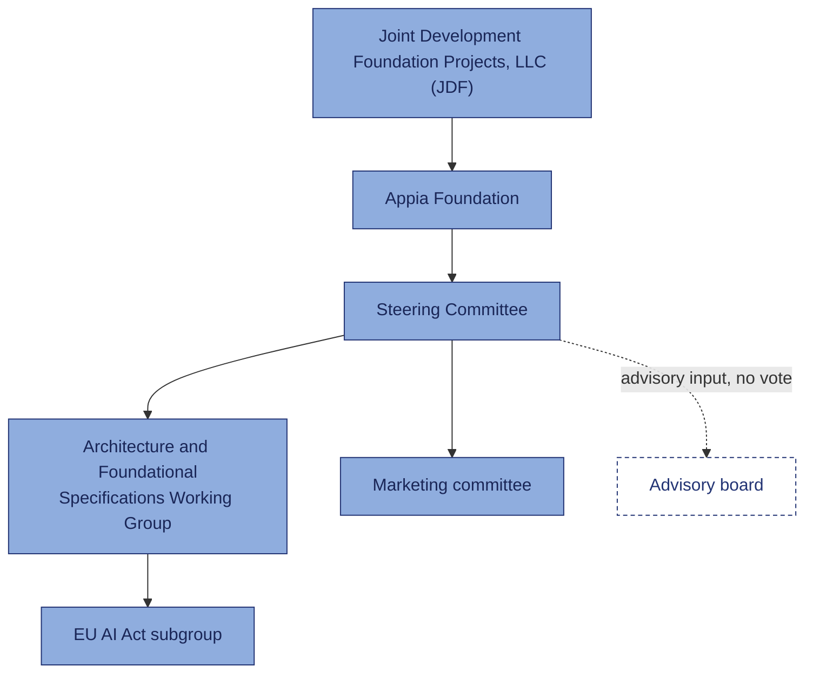

# Governance

Welcome — if this is your first week with Appia, start here. This page is a fast, plain-language
orientation to how the project is governed: who sits where, who approves what, and where your
own contribution would fit. It's deliberately not exhaustive and not a legal reference — for the
exact terms, see [Where to find the exact terms](#where-to-find-the-exact-terms) at the bottom of
this page.

## How Appia is governed

**Solid lines are formal reporting and approval authority. The dashed line to the Advisory board
is not** — the Advisory board brings outside perspective into the work but isn't a Member, has no
vote, and sits outside the chain above.

??? note "Governance breakdown"

    - **Joint Development Foundation Projects, LLC (JDF)** hosts Appia as an independent project
      series. JDF's role is limited to confirming Appia's activities conform with JDF's
      non-profit status and policies — it doesn't direct Appia's day-to-day work.
    - **Appia project** is the project series itself, established under the JDF Project Charter.
    - **Steering Committee** governs the project and approves Final Deliverables. Each Steering
      Member designates one participant to sit on it.
    - **Architecture and Foundational Specifications Working Group** develops Appia's overall
      architecture and related specifications, reporting to the Steering Committee.
    - **EU AI Act subgroup** is a sub-working group reporting into the Architecture working
      group, focused on aligning Appia's specifications with EU AI Act requirements.
    - **Marketing committee** functions as an extension of the Steering Committee, operating
      under its own mandate as approved by the Steering Committee — it doesn't have a separate
      charter of its own.
    - **Advisory board** brings academia, government, and civil-society perspectives into the
      work. It's non-member and has no vote — it sits outside the formal reporting line shown
      above, not underneath the Steering Committee.

??? note "Who's who"

    Appia's Project Charter defines a few membership levels — you'll see these terms used
    throughout the project, so it's worth knowing them up front:

    - **Steering Member** — a Member who may participate in every Working Group and (unless
      waived) designates a representative to the Steering Committee.
    - **General Member** — a Member who may participate in every Working Group, but doesn't
      participate on the Steering Committee.
    - **Contributor Member** — a Member who may participate in the specific Working Group(s)
      designated by the Steering Committee, doesn't participate on the Steering Committee, and
      isn't eligible to vote in decisions that require a Supermajority Vote.
    - **Working Group Participant** — any Member who has joined a Working Group. This is the
      role that carries the copyright and patent commitments described below.

??? note "How decisions get made"

    Both the Steering Committee and Working Groups try to decide things by **Consensus** —
    general agreement, without sustained opposition, and not necessarily unanimous. When
    Consensus isn't reached, the decision moves to a **Supermajority Vote**: at least 75% of
    Active Voting Members in favor. **Approval** is simply the term for a decision made this way.

    For specifications specifically, the path runs: a Draft Deliverable is approved by the
    Working Group ("Working Group Approved"), then — no sooner than 30 days later, to allow time
    for the patent exclusion process described below — the Steering Committee approves it as a
    **Final Deliverable**. Procedural appeals (lack of due process only, not disagreement with
    the outcome) must be filed within 30 days and are resolved within 90.

??? note "The specification framework, briefly"

    The Architecture and Foundational Specifications Working Group operates under a specific set
    of choices from Appia's Working Group Charter. In brief, so you know the shape of what
    you're agreeing to by contributing — not the full terms:

    - **Traditional Mode governance** — the working group follows the standard JDF governance
      rules (Consensus, then Supermajority Vote if needed) rather than the alternative
      "Community Specification" repository-based model.
    - **Copyright: Grant to Project** — when you contribute, you grant the project a broad,
      royalty-free license to use your contribution, and the resulting collective work's
      copyright belongs to the project. Published deliverables go out under Creative Commons
      Attribution-NoDerivatives 4.0 International, unless the Steering Committee designates
      another license.
    - **Patents: International Mode** — Final Deliverables follow the Common Patent Policy used
      by ITU-T/ITU-R/ISO/IEC, adapted to reference Appia instead. There's a standard process for
      excluding specific patent claims (a 30-day exclusion window opens automatically once a
      Draft Deliverable is Working Group Approved).

    None of this is the full text — see below for where to read the actual terms.

??? note "Where to find the exact terms"

    This page is an orientation, not a substitute for the governing documents. For the precise,
    binding language, see:

    - **Project Charter** — establishes the Steering Committee, membership levels, and
      decision-making rules.
    - **Working Group Charter** — establishes each Working Group's scope and the copyright/patent
      choices summarized above.
    - **Appendix A: Traditional Mode Governance** — the full decision-making and appeals process.
    - **Appendix B: Traditional Mode Intellectual Property Policy Options** — the full copyright
      and patent terms.

    <!-- TODO: content pending — link the documents above once they have a stable published
         location (e.g. a docs page or repo folder for the executed charter package). -->
